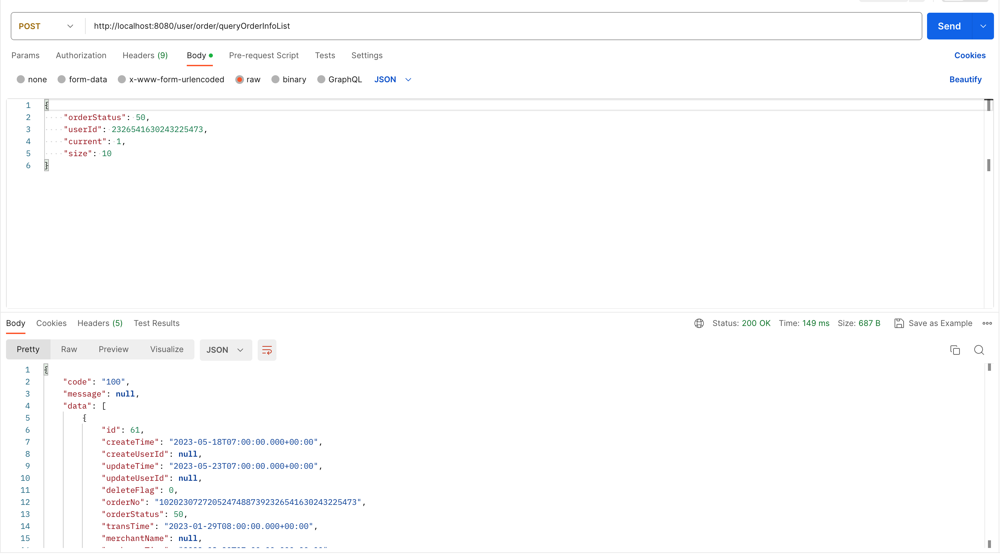
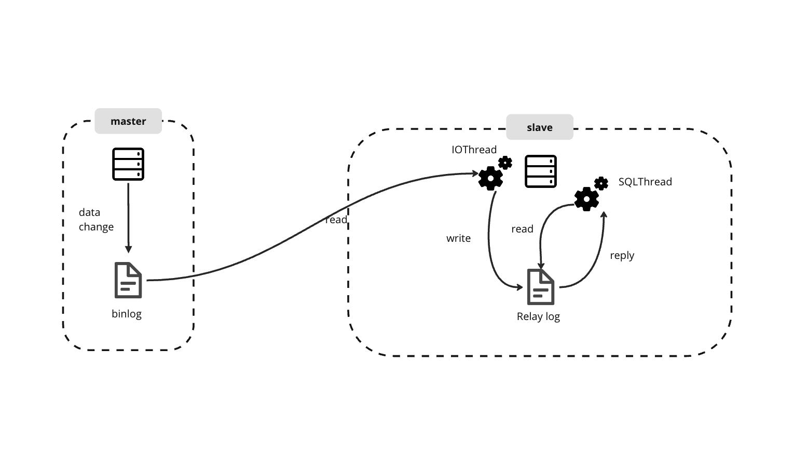

# SQL Database Performance Optimization Step by Step

- [SQL Database Performance Optimization Step by Step](#sql-database-performance-optimization-step-by-step)
  - [Step1 Add Index](#step1-add-index)
    - [Table Design](#table-design)
    - [Generate Fake Data](#generate-fake-data)
    - [Without an index](#without-an-index)
    - [With an index](#with-an-index)
  - [Step2 Introduce Redis as cache](#step2-introduce-redis-as-cache)
    - [Core Code](#core-code)
    - [Performance Evaluation](#performance-evaluation)
      - [Test API by Postman](#test-api-by-postman)
    - [Strategies to Enhance Cache Hit Rate](#strategies-to-enhance-cache-hit-rate)
      - [1. Identifying Appropriate Business Scenarios](#1-identifying-appropriate-business-scenarios)
      - [2. Setting the Cache Capacity Judiciously](#2-setting-the-cache-capacity-judiciously)
      - [3. Fine-tuning Cache Expiration Time](#3-fine-tuning-cache-expiration-time)
      - [4. Mitigating Cache Penetration](#4-mitigating-cache-penetration)
      - [5. Implementing Cache Warm-Up](#5-implementing-cache-warm-up)
  - [Step3 Master-slave synchronization](#step3-master-slave-synchronization)
      - [The principle of master-slave replication](#the-principle-of-master-slave-replication)
      - [Advantages of master-slave replication](#advantages-of-master-slave-replication)
  - [Step4 Read/Write Splitting](#step4-readwrite-splitting)
  - [Step5 Database Table Horizontal Sharding and Partitioning](#step5-database-table-horizontal-sharding-and-partitioning)
      - [1. Horizontal Sharding](#1-horizontal-sharding)
      - [2. Horizontal Partitioning](#2-horizontal-partitioning)
      - [3. Horizontal Sharding and Partitioning](#3-horizontal-sharding-and-partitioning)
  - [Step6 Router Policy and Global ID in a Multi-Database and Multi-Table Environment](#step6-router-policy-and-global-id-in-a-multi-database-and-multi-table-environment)
    - [Scenarios for Multi-Table Queries](#scenarios-for-multi-table-queries)
    - [Router Policy for User (toC)](#router-policy-for-user-toc)
      - [1. Start from a Multi-table environment](#1-start-from-a-multi-table-environment)
      - [2. Expand to a Multi-database and Multi-table environment](#2-expand-to-a-multi-database-and-multi-table-environment)
    - [Router Policy for Merchant (toB)](#router-policy-for-merchant-tob)
    - [Generate globally unique IDs for order table](#generate-globally-unique-ids-for-order-table)
    - [Optimize the Scalability of Database Servers](#optimize-the-scalability-of-database-servers)
      - [1. Data migration](#1-data-migration)
      - [2. Load balancing](#2-load-balancing)

## Step1 Add Index

Indexes are used in MySQL to find rows with specific column values quickly. Without an index, MySQL must begin with the first row and then read through the entire table to find the relevant rows, which is inefficient for large datasets.

### Table Design

Table 1: `order_info`

| Field                  | Data Type      | Description                      |
| ---------------------- | -------------- | -------------------------------- |
| id                     | BIGINT         | Auto-incremented primary key     |
| order_no               | VARCHAR(255)   | Order number                     |
| order_amount           | DECIMAL(10, 2) | Order amount                     |
| order_freight          | DECIMAL(10, 2) | Order freight                    |
| order_status           | INT            | Order status                     |
| trans_time             | DATE           | Transaction time                 |
| pay_status             | BIGINT         | Payment status                   |
| merchant_id            | BIGINT         | Merchant ID                      |
| user_id                | BIGINT         | User ID                          |
| recharge_time          | DATE           | Recharge time (Date of recharge) |
| pay_discount_amount    | DECIMAL(10, 2) | Payment discount amount          |
| pay_amount             | DECIMAL(10, 2) | Amount paid                      |
| address_id             | BIGINT         | Address ID                       |
| remark                 | VARCHAR(255)   | Remark                           |
| delivery_type          | BIGINT         | Delivery type                    |
| delivery_status        | BIGINT         | Delivery status                  |
| delivery_expect_time   | DATE           | Expected delivery time           |
| delivery_complete_time | DATE           | Delivery completion time         |
| delivery_amount        | DECIMAL(10, 2) | Delivery amount                  |
| buyer_status           | BIGINT         | Buyer status                     |
| coupon_id              | BIGINT         | Coupon ID                        |
| create_user            | BIGINT         | User create                      |
| update_user            | BIGINT         | User update                      |
| create_time            | DATE           | Create time                      |
| update_time            | DATE           | Update time                      |
| delete_flag            | INT            | 0 is not deleted, 1 is deleted   |

Table 2: `order_item_detail`

| Field           | Data Type      | Description                    |
| :-------------- | -------------- | ------------------------------ |
| id              | BIGINT         | Auto-incremented primary key   |
| order_no        | VARCHAR(255)   | Order number                   |
| product_id      | BIGINT         | Product ID                     |
| category_id     | BIGINT         | Category ID                    |
| goods_num       | DECIMAL(10, 2) | Number of goods                |
| goods_price     | DECIMAL(10, 2) | Price per unit                 |
| goods_amount    | DECIMAL(10, 2) | Total goods amount             |
| discount_amount | DECIMAL(10, 2) | Discount amount                |
| discount_id     | BIGINT         | Discount ID                    |
| create_user     | BIGINT         | User create                    |
| update_user     | BIGINT         | User update                    |
| create_time     | DATE           | Create time                    |
| update_time     | DATE           | Update time                    |
| delete_flag     | INT            | 0 is not deleted, 1 is deleted |

### Generate Fake Data

Use Python script with faker lib to generate a hundred thousand rows for the two tables.

```python
import random
import decimal
from faker import Faker
import datetime
import pymysql

num_records = 100000

db = pymysql.connect(
    host="localhost",
    user="root",
    password="",
    database="monomer_order"
)

cursor = db.cursor()
fake = Faker()

def get_order_no(user_id):
    order_id_key = get_order_id_key(user_id)
    return order_id_key

def get_order_id_key(user_id):
    return '10' + get_date_time_key() + get_auto_no_key() + to_code(user_id)

def get_date_time_key():
    date_time = datetime.datetime.now().strftime("%Y%m%d%H%M%S")
    return date_time

def get_auto_no_key():
    range_start = 10 ** (6 - 1)
    range_end = (10 ** 6) - 1
    return str(random.randint(range_start, range_end))

def to_code(value):
    return str(value).rjust(4, '0')

def get_bigint():
    return random.randint(0, 9223372036854775807)

for _ in range(num_records):
    user_id = get_bigint()
    order_no = get_order_no(user_id)
    order_amount = decimal.Decimal(random.uniform(100, 10000))
    order_freight = decimal.Decimal(random.uniform(5, 50))
    order_status = random.choice([10, 20, 30, 40, 50, 55, 60, 70])
    trans_time = fake.date_between(start_date="-1y", end_date="today")
    pay_status = random.choice([1, 2])
    merchant_id = get_bigint()
    recharge_time = fake.date_between(start_date="-1y", end_date="today")
    pay_discount_amount = decimal.Decimal(random.uniform(0, 100))
    pay_amount = decimal.Decimal(random.uniform(100, 10000))
    address_id = get_bigint()
    remark = fake.text(max_nb_chars=100)
    delivery_type = random.choice([1, 2])
    delivery_status = random.choice([0, 1, 2])
    delivery_expect_time = fake.date_between(start_date="-1y", end_date="today")
    delivery_complete_time = fake.date_between(start_date=delivery_expect_time, end_date="today")
    delivery_amount = decimal.Decimal(random.uniform(5, 50))
    buyer_status = random.choice([0, 1, 2, 3])
    coupon_id = get_bigint()
    create_time = fake.date_between(start_date="-1y", end_date="today")
    update_time = fake.date_between(start_date=create_time, end_date="today")
    delete_flag = random.choice([0, 1])

    cursor.execute(
        "INSERT INTO order_info (order_no, order_amount, order_freight, order_status, trans_time, pay_status, merchant_id, user_id, recharge_time, pay_discount_amount, pay_amount, address_id, remark, delivery_type, delivery_status, delivery_expect_time, delivery_complete_time, delivery_amount, buyer_status, coupon_id, create_time, update_time, delete_flag) VALUES (%s, %s, %s, %s, %s, %s, %s, %s, %s, %s, %s, %s, %s, %s, %s, %s, %s, %s, %s, %s, %s, %s, %s)",
        (
            order_no,
            order_amount,
            order_freight,
            order_status,
            trans_time,
            pay_status,
            merchant_id,
            user_id,
            recharge_time,
            pay_discount_amount,
            pay_amount,
            address_id,
            remark,
            delivery_type,
            delivery_status,
            delivery_expect_time,
            delivery_complete_time,
            delivery_amount,
            buyer_status,
            coupon_id,
            create_time,
            update_time,
            delete_flag,
        )
    )

    order_item_detail_data = []
    for _ in range(random.randint(1, 5)):
        product_id = get_bigint()
        category_id = get_bigint()
        goods_num = decimal.Decimal(random.uniform(1, 10))
        goods_price = decimal.Decimal(random.uniform(10, 100))
        goods_amount = goods_num * goods_price
        discount_amount = decimal.Decimal(random.uniform(0, 10))
        discount_id = get_bigint()

        order_item_detail_data.append(
            (
                order_no,
                product_id,
                category_id,
                goods_num,
                goods_price,
                goods_amount,
                discount_amount,
                discount_id,
                user_id,  # Replaced create_user and update_user with user_id as it was not defined
                user_id,
                create_time,
                update_time,
                delete_flag,
            )
        )

    cursor.executemany(
        "INSERT INTO order_item_detail (order_no, product_id, category_id, goods_num, goods_price, goods_amount, discount_amount, discount_id, create_user, update_user, create_time, update_time, delete_flag) VALUES (%s, %s, %s, %s, %s, %s, %s, %s, %s, %s, %s, %s, %s)",
        order_item_detail_data,
    )

db.commit()
cursor.close()
db.close()
```

### Without an index

```sql
SELECT order_info.order_no, order_info.user_id, order_item_detail.*
FROM order_info
LEFT JOIN order_item_detail
ON order_info.order_no = order_item_detail.order_no
WHERE order_info.user_id = 403069986843429898;
```

**The duration is: 0.215 sec / 0.000010 sec≈ 21500 ms.**

MySQL has to use a full table scan, which requires going through every row of the table one by one to find the matching rows. This operation has a time complexity of **O(n)**, where n is the number of rows in the table. This means that the time taken to execute the operation increases linearly with the size of the table.

### With an index

```sql
ALTER TABLE order_info ADD INDEX idx_order_info_user_id (user_id);
ALTER TABLE order_info ADD INDEX idx_order_info_order_no (order_no);
ALTER TABLE order_item_detail ADD INDEX idx_order_item_detail_order_no (order_no);
```

- **`user_id`** in **`order_info`** table: This could speed up filtering operations based on the **`user_id`**.
- **`order_no`** in both **`order_info`** and **`order_item_detail`** tables: These could speed up the join operation between these two tables.

With this index in place, run the same query:

```sql
SELECT order_info.order_no, order_info.user_id, order_item_detail.*
FROM order_info
LEFT JOIN order_item_detail
ON order_info.order_no = order_item_detail.order_no
WHERE order_info.user_id = 403069986843429898;
```

**The duration is: 0.00070 sec / 0.000016 sec≈ 43.75 ms.**

**Performance Improvement Percentage ≈ 99.99674%**

When an index is available, MySQL tends to use B-tree index. In a B-tree index, data is stored in a tree-like structure where each node is sorted. This allows MySQL to use a process similar to a binary search, which significantly reduces the number of operations needed to find a match. The search operation has a time complexity of **O(log n)**, where n is the number of entries in the index.

PS: The storage engine used here was InnoDB.

## Step2 Introduce Redis as cache

Although the use of index improves the query speed of mysql, a large number of requests to access MySQL during peak hours will cause the MySQL server to respond too slowly.


In order to reduce the burden on the MySQL server, Redis is introduced as a cache. In order to make Redis achieve the desired effect, it is necessary to improve the cache hit rate as much as possible.

### Core Code 

```java
public Page<OrderInfoVO> queryOrderInfoList(OrderInfoQuery orderInfoQuery) {
    // Validate the orderInfoQuery to ensure it meets the required criteria
    OrderValidation.checkVerifyOrderQuery(orderInfoQuery);

    // Create a new Page object to hold the results
    Page<OrderInfoVO> page = new Page<>();

    // Set the current page number and page size based on the query parameters
    page.setCurrent(orderInfoQuery.getCurrent());
    page.setSize(orderInfoQuery.getSize());

    // Query completed orders
    if (FINISH.equals(orderInfoQuery.getOrderStatus())) {
        // Assemble the Redis key based on the query parameters to uniquely identify the data
        // redis key = user_id + page_number + page_size
        String redisKey = orderInfoQuery.getUserId() + orderInfoQuery.getCurrent().toString() + orderInfoQuery.getSize().toString();

        // Check if the data is available in the Redis cache
        Object redisObject = redisUtils.get(redisKey);

        // If Redis cache is empty, query the data from the database
        if (Objects.isNull(redisObject)) {
            // Query the order information list from the database
            Page<OrderInfoVO> userOrderInfoVOPage = orderInfoRepository.queryOrderInfoList(page, orderInfoQuery);

            // Set the result into Redis cache with an expiration time of one hour (3600 seconds)
            redisUtils.set(redisKey, userOrderInfoVOPage, 3600L, TimeUnit.SECONDS);

            // Return the query result obtained from the database
            return userOrderInfoVOPage;
        }

        // If Redis cache contains the data, return it directly without querying the database
        log.info("Retrieved data from Redis, key: {}", redisKey);
        return (Page<OrderInfoVO>) redisObject;
    }

    // If the order status is not 'FINISH', query the order information list from the database
    return orderInfoRepository.queryOrderInfoList(page, orderInfoQuery);
}
```

A `Pag` object is created to hold the results of the query. The current page number and page size are set based on the `orderInfoQuery` parameters to determine which subset of data should be fetched.

The method then checks if the query is specifically for completed orders by comparing the order status with a constant `FINISH`. If it is, the method performs the following steps:

1. Assembles a Redis key using the `orderInfoQuery` parameters (user ID, current page number, and page size) to uniquely identify the cached data.
2. Checks if the data is available in the Redis cache.
3. If the Redis cache is empty (no cached data found), it queries the database for the order information. The result is stored in the Redis cache with a specified expiration time of one hour (3600 seconds).
4. The method returns the query result obtained from the database.

If the query is not for completed orders, the method simply queries the order information list from the database without caching and returns the results.

### Performance Evaluation

#### Test API by Postman



Based on the provided log information, we can observe a significant performance improvement when fetching data from Redis compared to fetching data from MySQL. Here's a comparison of the two scenarios:

- First Time (Data from MySQL)
  - `INFO 66223 --- [nio-8080-exec-9] c.oliver.controller.UserOrderController  : Time taken to query user order: 107`

- Second Time (Data from Redis)
  - `INFO 66223 --- [nio-8080-exec-1] c.o.s.u.impl.UserOrderInfoServiceImpl    : Retrieved data from Redis, key: 2326541630243225473110`
  - `INFO 66223 --- [nio-8080-exec-1] c.oliver.controller.UserOrderController  : Time taken to query user order: 14`

This difference in query time indicates that Redis is significantly faster in responding to data retrieval requests compared to MySQL. Redis is an in-memory data store, which means it stores data in RAM, allowing for faster data access and retrieval. On the other hand, MySQL is a disk-based database, and even though it is well-optimized, disk access is generally slower than RAM access.

**Performance Improvement Percentage ≈ 93.46%%**

### Strategies to Enhance Cache Hit Rate

#### 1. Identifying Appropriate Business Scenarios

Cache systems are highly effective in scenarios where read operations significantly outnumber write operations, preferably in high-frequency access scenarios. 

#### 2. Setting the Cache Capacity Judiciously

Proper cache size allocation is vital for its optimal functioning. If the cache capacity is set too low, it will frequently trigger Redis's memory eviction mechanism, leading to key deletions and thereby neutralizing the caching effect.

#### 3. Fine-tuning Cache Expiration Time

Precise calibration of cache expiration time can prevent simultaneous invalidation of keys, which could otherwise lead all requests straight to the database, causing a cache breakdown. An incorrect expiration time setting can significantly impact cache performance.

#### 4. Mitigating Cache Penetration

When querying data, the initial check should be from the Redis cache. If not found, the database should be queried. In case the data is absent in both places, it can lead to cache penetration.

If a high volume of such requests is received, and the data is not available either in Redis or in the database, it could trigger a cache avalanche, potentially leading to a service crash.

To prevent this, an empty object can be set in the cache for such query requests, effectively returning an empty object to the requester.

#### 5. Implementing Cache Warm-Up

To enhance cache hit rate, the practice of "warming up" the cache can be employed. This process involves pre-loading relevant data from the database into the Redis cache. Thus, when a query is made for the first time, the data can be directly fetched from the cache, resulting in faster response times.

## Step3 Master-slave synchronization

Transfer the operation of the master database to the slave database through binary logs, and then re-execute these logs on the slave database. Keep the slave library and the main library data in sync.



#### The principle of master-slave replication

1. Master DB will save the data changes in the binary log file Binlog when the transaction is submitted.
2. Slave DB reads Master DB's binary log file Binlog and writes it to the relay log Relay Log.

3. Slave DB redoes events in the relay log, which will change and reflect its own data.

#### Advantages of master-slave replication

1. If there is a problem with the main library, quickly switch to provide services from the library.

2. Achieve read-write separation and reduce the access pressure of the main library.

3. Backups can be performed from the library to avoid affecting the main library service during the backup.

## Step4 Read/Write Splitting


## Step5 Database Table Horizontal Sharding and Partitioning

In Step 3, we improved the performance of data retrieval by implementing the master-slave mode. However, we have yet to find a solution to enhance the **writing** capability of the primary database. Therefore, in this phase, I propose horizontally sharding and partitioning the tables in the database to improve the performance of data insertion.

#### 1. Horizontal Sharding


#### 2. Horizontal Partitioning


#### 3. Horizontal Sharding and Partitioning


Horizontal sharding and partitioning offer the advantages of increased parallelism, reduced contention, improved scalability, targeted optimization, and workload isolation, resulting in optimized write performance. By distributing data across multiple shards or partitions, concurrent writes can be achieved, minimizing contention for system resources, and enabling linear scalability. Each shard or partition can be optimized individually, allowing for tailored indexing and performance optimizations, while workload isolation prevents write-intensive operations from impacting other critical processes. 

## Step6 Router Policy and Global ID in a Multi-Database and Multi-Table Environment

### Scenarios for Multi-Table Queries


After an order is created, from the user's perspective, there is a need to query the order and check its status. From the merchant's perspective, there is a requirement to retrieve order information and analyze the orders.


However, in a multi-table environment, when a user places an order, the created orders may be stored in different tables, requiring queries to involve multiple tables.

Therefore, to improve query efficiency, it is necessary to establish a routing rule that ensures orders created by the same user are stored in the same table as much as possible.

### Router Policy for User (toC)

#### 1. Start from a Multi-table environment


Since the user_id is unique, it can be used as the routing key in this scenario. When a user places an order and the order is generated, the user_id is hashed, and then the resulting value is used to perform modulo operation with the number of tables. This ensures that the order information for the same user is stored in the same table.

#### 2. Expand to a Multi-database and Multi-table environment

Following the previous approach, first locate the database containing the order information, and then find the corresponding table within it.


User places an order -> Generate an order -> Use the hash value of user_id to perform modulo operation with the number of databases to locate the corresponding database -> Divide the hash value of user_id by the number of tables and perform modulo operation to locate the corresponding table.

#### 3. Core Code

```Java
/**
 * Custom database routing algorithm: user_id % db_size
 */
public class OrderDbShardingByUserAlgorithm implements ComplexKeysShardingAlgorithm<Comparable<?>> {

    /**
     * The main method to perform sharding for databases based on the sharding value.
     * @param dbs The collection of available database names.
     * @param shardingValue The sharding value containing the column names and their corresponding sharding values.
     * @return The collection of actual database names that the data should be routed to.
     */
    @Override
    public Collection<String> doSharding(Collection<String> dbs, ComplexKeysShardingValue<Comparable<?>> shardingValue) {
        Collection<Comparable<?>> orderNos = shardingValue.getColumnNameAndShardingValuesMap().get("order_no");
        Collection<Comparable<?>> userIds = shardingValue.getColumnNameAndShardingValuesMap().get("user_id");
        Set<String> actualDbNames = null;

        // Perform sharding based on "order_no" column if available
        if (CollectionUtils.isNotEmpty(orderNos)) {
            actualDbNames = orderNos.stream()
                    .map(orderNo -> getActualDbName(String.valueOf(orderNo), dbs))
                    .collect(Collectors.toSet());
        }
        // Otherwise, perform sharding based on "user_id" column if available
        else if (CollectionUtils.isNotEmpty(userIds)) {
            actualDbNames = userIds.stream()
                    .map(userId -> getActualDbName(String.valueOf(userId), dbs))
                    .collect(Collectors.toSet());
        }

        return actualDbNames;
    }

    /**
     * Method to calculate the actual database name to which data should be routed.
     * @param shardingValue The sharding value (either order_no or user_id) for which the database should be determined.
     * @param dbs The collection of available database names.
     * @return The actual database name to which the data should be routed.
     */
    public String getActualDbName(String shardingValue, Collection<String> dbs) {
        // Extract the last three digits of the sharding value (either order_no or user_id)
        String userIdSuffix = StringUtils.substring(shardingValue, shardingValue.length() - 3);

        // Use the last three digits of the sharding value for routing
        int dbSuffix = userIdSuffix.hashCode() % dbs.size();

        // Find the database name that ends with the calculated suffix
        for (String db : dbs) {
            if (db.endsWith(String.valueOf(dbSuffix))) {
                return db;
            }
        }

        // Return null if no matching database name is found (this should not happen in a well-configured sharded environment)
        return null;
    }
}
```

```Java
/**
 * Custom database routing algorithm: user_id / db_size % db_size
 */
public class OrderTableShardingByUserAlgorithm implements ComplexKeysShardingAlgorithm<Comparable<?>> {

    /**
     * The main method to perform sharding for tables based on the sharding value.
     * @param tables The collection of available table names.
     * @param shardingValue The sharding value containing the column names and their corresponding sharding values.
     * @return The collection of actual table names that the data should be routed to.
     */
    @Override
    public Collection<String> doSharding(Collection<String> tables, ComplexKeysShardingValue<Comparable<?>> shardingValue) {
        Collection<Comparable<?>> orderNos = shardingValue.getColumnNameAndShardingValuesMap().get("order_no");
        Collection<Comparable<?>> userIds = shardingValue.getColumnNameAndShardingValuesMap().get("user_id");
        Set<String> actualTableNames = null;

        // Perform sharding based on "order_no" column if available
        if (CollectionUtils.isNotEmpty(orderNos)) {
            actualTableNames = orderNos.stream()
                    .map(orderNo -> getActualTableName(String.valueOf(orderNo), tables))
                    .collect(Collectors.toSet());
        }
        // Otherwise, perform sharding based on "user_id" column if available
        else if (CollectionUtils.isNotEmpty(userIds)) {
            actualTableNames = userIds.stream()
                    .map(userId -> getActualTableName(String.valueOf(userId), tables))
                    .collect(Collectors.toSet());
        }

        return actualTableNames;
    }

    /**
     * Method to calculate the actual table name to which data should be routed.
     * @param shardingValue The sharding value (either order_no or user_id) for which the table should be determined.
     * @param tables The collection of available table names.
     * @return The actual table name to which the data should be routed.
     */
    public String getActualTableName(String shardingValue, Collection<String> tables) {
        // Get the last three digits of the sharding value (either order_no or user_id)
        String userIdSuffix = StringUtils.substring(shardingValue, shardingValue.length() - 3);

        // Use the last three digits of the sharding value for routing
        int tableSuffix = userIdSuffix.hashCode() / tables.size() % tables.size();

        // Find the table name that ends with the calculated suffix
        for (String table : tables) {
            if (table.endsWith(String.valueOf(tableSuffix))) {
                return table;
            }
        }

        // Return null if no matching table name is found (this should not happen in a well-configured sharded environment)
        return null;
    }
}

```

Data Flow Direction:

1. Request Data: The data flow begins with a request for data from the client or user.
2. Business Logic Processing: The request is processed by the application's business logic layer, where specific business rules, data processing, and other operations are performed.
3. Mapper Generates Logical SQL: Within the business logic layer, a data access layer (often called a mapper) generates logical SQL queries based on the business requirements and data access operations.
4. Routing Key: Before the SQL queries are executed, a routing key is determined based on the sharding key present in the logical SQL. The sharding key is a part of the data that is used to determine how data should be distributed across different databases or tables.
5. Routing Strategy: The routing key is used by the routing strategy of ShardingSphere, which defines how the routing key is mapped to specific databases or tables. The routing strategy is defined in the ShardingSphere configuration.
6. Specific Database: Using the routing strategy, ShardingSphere identifies the specific database (or databases) to which the data request should be directed based on the routing key.
7. Selecting Table: Once the database is determined, ShardingSphere further selects the specific table (or tables) within that database where the data should be stored or retrieved, again based on the routing key.
8. ShardingSphere Generates Actual SQL: Finally, ShardingSphere generates the actual SQL statements that are specific to the selected databases and tables. The generated SQL contains the necessary database-specific syntax and is ready to be executed against the target database.

### Router Policy for Merchant (toB)

The merchant should be able to retrieve the corresponding user's order information. However, the merchant should not use user_id as the routing key. This is not reasonable.

Therefore, from the user's perspective, use user_id as the routing key. From the merchant's perspective, use merchant_id as the routing key.。


Introduce RocketMQ as the message queue. When a user places an order, the order number is sent to the MQ. The merchant consumes this MQ message, retrieves the order information based on the order number, and then inserts the order information into the user's database.

### Generate globally unique IDs for order table

Introduce the SnowFlake algorithm.


Snowflake algorithm can generate globally unique order IDs based on different servers and timestamps.

[Learn more about Snowflake Algorithm](https://github.com/oliverXS/snowflake-algorithm-java)

### Optimize the Scalability of Database Servers

Introduce consistent hash algorithm to replace the hash algorithm for the fixed number of servers.

[Learn more about Consistent Hashing](https://github.com/oliverXS/consistent-hashing-java)


#### 1. Data migration

Set the database server on a hash ring of length 2^32 -1. When the server increases or decreases, the amount of data that needs to be migrated is greatly reduced.

#### 2. Load balancing

Introduce virtual nodes on the hash ring to ensure load balancing and avoid a large number of requests to access the same server.
